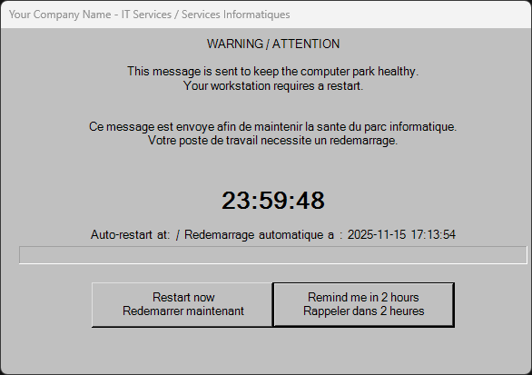
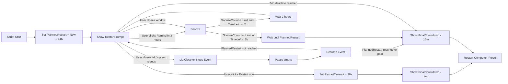

# Restart Prompt Script

PowerShell script that manages restart prompts with a Windows Forms GUI. Users can restart immediately (with a short safety countdown) or snooze in 2-hour increments up to a 24-hour hard deadline. At the deadline, a final 15-minute countdown enforces restart.

## Overview

This script provides a user-friendly, bilingual (EN/FR-CA) dialog to keep workstations healthy while minimizing disruption.

- **Bilingual support** (English / French Canadian) - customizable
- **Live countdown + progress bar** to a hard 24h deadline
- **Snooze system** with 2-hour reminders (up to 13 deferrals by default)
- **Automatic enforcement** via a final 15-minute countdown
- **Detailed logging** of user actions and key events
- **Fully customizable** colors, messages, and branding



## Features

- **Always-on-top modal dialog**: Fixed dialog, no minimize/maximize/close controls
- **Safe default action**: Pressing Enter triggers "Remind in 2 hours"; focus is on the "Remind in 2 hours" button
- **Real-time countdown**: Shows remaining time until the absolute deadline and ETA
- **24h progress bar**: Visualizes time elapsed toward the 24-hour window
- **Snooze limit**: Up to 13 deferrals (2 hours each) - configurable
- **Hard deadline (24h)**: Cannot be extended by snoozes - configurable
- **Final countdowns**:
  - 30 seconds when the user chooses "Restart now"
  - 15 minutes when enforcement begins (deadline reached or snooze exhausted)
- **Event logging**: Configurable log directory and filename

## Configuration

All customization options are located at the top of the script in the **CONFIGURATION SECTION**. Simply edit the variables to match your organization's needs.

### Company/Organization Information

```powershell
$CompanyName = "Your Company Name"
$CompanyITDepartment = "IT Services / Services Informatiques"
$WindowTitle = "$CompanyName - $CompanyITDepartment"
```

### UI Colors

All colors are defined in hex format (`#RRGGBB`):

```powershell
$ColorBackground = "#002952"      # Main background color
$ColorButtonBackground = "#002952" # Button background color
$ColorText = "#FFFFFF"             # Text color (White)
```

### Font Configuration

```powershell
$FontFamily = "Century Gothic"
$FontSize = 10
$FontSizeLarge = 20
$FontSizeCountdown = 32
```

### User Messages

All user-facing messages are configurable and support bilingual text:

```powershell
$MessageWarning = "WARNING / ATTENTION`n..."
$MessageRestartNow = "Restart now`nRedemarrer maintenant"
$MessageRemindMe = "Remind me in 2 hours`nRappeler dans 2 heures"
# ... and more
```

### Timing Configuration

```powershell
$SnoozeLimit = 13          # Maximum number of snoozes (13 × 2 hours = 24 hours max)
$SnoozeIncrement = 2*60*60 # Two hours per reminder (in seconds)
$InitialDelay = 24*60*60   # Absolute window before enforcement (24 hours)
$RestartTimeout = 15 * 60  # Final countdown when enforcing (15 minutes)
```

### Logging Configuration

```powershell
$LogDir = "C:\Temp"
$LogFileName = "Prompt-Reboot.log"
```

**Note**: When the user clicks "Restart now", the script temporarily uses a 30-second timeout for that immediate restart path.

## User Experience Scenarios

| Scenario                  | User Action                                            | System Response                                                                                      |
|---------------------------|-------------------------------------------------------|------------------------------------------------------------------------------------------------------|
| **Immediate Restart**     | Clicks "Restart now"                                  | 30-second countdown is shown, then restart is forced                                                 |
| **Request Reminder**      | Clicks "Remind in 2 hours" or presses Enter           | Dialog closes; reappears after 2 hours                                                               |
| **Close Window**          | Attempts to close the window                          | If snoozes remain and ≥2h remain until deadline, treated like a reminder; otherwise final enforcement flow starts |
| **Lid Close**             | Closes the laptop lid (system sleep/standby occurs)   | On resume, dialog reappears if deadline/snooze not reached; timer continues running during sleep      |
| **No Action**             | Ignores dialog                                        | When the 24h deadline hits, a 15-minute final countdown appears, then forced restart                 |
| **Maximum Reminders**     | Uses all 13 reminders                                 | 15-minute final countdown begins                                                                     |
| **Late Reminder**         | Requests reminder with <2h remaining                  | Waits until exact deadline if needed, then starts the 15-minute countdown                            |
| **Past Deadline**         | Wakes/resumes after 24h window expired                | Immediately shows/enforces final 15-minute countdown; restart is forced after countdown              |

### Flow Diagram



## Logged Events

Examples of log entries:

1. **Script start**
   ```
   [YYYY-MM-DD HH:MM:SS] Script started. Planned restart at YYYY-MM-DD HH:MM:SS
   ```

2. **Reminder request** (button click or permitted close)
   ```
   [YYYY-MM-DD HH:MM:SS] User clicked to be reminded
   ```

3. **Closed without action** (no snoozes/time left)
   ```
   [YYYY-MM-DD HH:MM:SS] User closed the window without action.
   ```

4. **Deadline reached / enforcement begins**
   ```
   [YYYY-MM-DD HH:MM:SS] Initial delay expired; starting final 15-minute countdown
   [YYYY-MM-DD HH:MM:SS] Starting final 15-minute countdown
   ```

5. **Final countdown started**
   ```
   [YYYY-MM-DD HH:MM:SS] Final countdown started
   ```

## Deployment

Because this script displays a Windows Forms GUI, it must run in the interactive user session.

### Requirements

- **Script type**: PowerShell
- **Architecture**: 64-bit PowerShell (recommended)
- **Run as**: Current Logged-on User (required for GUI display)
- **Permissions**: Administrator rights for `Restart-Computer -Force`

### Suggested Deployment Methods

#### RMM/MDM Solutions (NinjaOne, Intune, etc.)

- **Trigger**: When pending reboot detected for X hours in a policy
- **Run as**: Current Logged-on User
- **Architecture**: 64-bit PowerShell

#### Group Policy / Scheduled Task

- Create a scheduled task that runs as the logged-on user
- Trigger based on your organization's requirements
- Ensure the task runs with appropriate user context

#### Manual Execution

Simply run the script with appropriate permissions:
```powershell
.\EUD_Prompt-Reboot.ps1
```

## Technical Details

### Functions

- `Show-RestartPrompt`: Main dialog; countdown, ETA, progress bar, default Enter→Remind
- `Snooze`: Handles reminder logic and deadline enforcement
- `Show-FinalCountdown`: Displays the countdown before restart (30s for immediate path; 15m for enforcement)
- `Write-Log`: Logging utility

### Global Variables

- `$global:SnoozeCount`: Number of reminders already used
- `$global:PlannedRestart`: Absolute deadline timestamp

### Behavior Notes

- **Default Enter behavior**: Enter focuses and activates "Remind in 2 hours".
- **In-memory state**: If the process is killed/restarted, counters reset.
- **Window controls**: Fixed dialog (no minimize/maximize/close); close attempts are handled by logic described above.
- **Timer cadence**: Countdown/progress update every second; 24h progress bar maximum.
- **Enforcement**: 24h deadline is absolute; cannot be extended by snoozes.

## Customization Guide

### Changing Colors

Edit the color variables in the configuration section:

```powershell
# Example: Blue theme
$ColorBackground = "#1E3A8A"
$ColorButtonBackground = "#1E40AF"
$ColorText = "#FFFFFF"

# Example: Dark theme
$ColorBackground = "#1F2937"
$ColorButtonBackground = "#374151"
$ColorText = "#F9FAFB"
```

### Changing Messages

All messages support multi-line text using backticks (`n) or here-strings:

```powershell
$MessageWarning = @"
WARNING

Your computer needs to restart.
Please save your work.

"@
```

### Changing Timing

Adjust the timing variables to match your organization's policies:

```powershell
$SnoozeLimit = 6           # Fewer snoozes
$SnoozeIncrement = 4*60*60 # 4-hour increments
$InitialDelay = 48*60*60   # 48-hour window
$RestartTimeout = 10 * 60  # 10-minute final countdown
```

## Troubleshooting

### Log file not created

- Verify write permissions to the configured `$LogDir`
- Ensure the directory exists or can be created
- Confirm script execution permissions

### Dialog not appearing

- Confirm an interactive user session is active
- Run with appropriate privileges (logged-on user context)
- Ensure Windows Forms assemblies are available
- Check that the script is running in 64-bit PowerShell if required

### Colors not applying correctly

- Verify hex color format is correct (`#RRGGBB`)
- Ensure color values are valid (0-9, A-F)
- Test with common colors first (e.g., `#000000` for black, `#FFFFFF` for white)

### Font not found

- Verify the font family name matches exactly (case-sensitive)
- Use a system font or ensure custom fonts are installed
- Fallback to common fonts: "Arial", "Segoe UI", "Microsoft Sans Serif"

## License

This script is provided as-is for public use. Modify and distribute as needed for your organization.

## Contributing

Contributions, issues, and feature requests are welcome! Please feel free to submit a pull request or open an issue.

## Quick Reference

**Default log file**: `C:\Temp\Prompt-Reboot.log` (configurable)

**Key default settings**:
- Max reminders: 13
- Reminder interval: 2 hours
- Hard deadline: 24 hours (`$InitialDelay`)
- Final countdown (enforcement): 15 minutes (`$RestartTimeout`)

**Expected outcome**: System will restart within 24 hours of script start (configurable), with a 15-minute final warning at enforcement.


